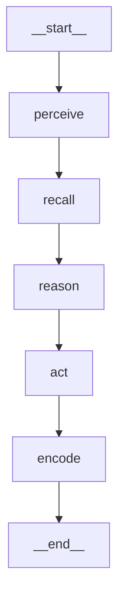

# LangGraph 决策子图实现报告

> 把 AI 玩家的内层决策子图（Start.md §10）**真正用 LangGraph 的 `StateGraph` 实现**：
> `感知 → 召回 → 推理 → 行动 → 编码` 五个节点建成一张可执行、可观测的图。
> 验证：`uv run pytest` → **78 passed**（含 7 个 langgraph 用例）；
> `autoplay --policy langgraph` 全 AI 整局收敛、狼零次误伤队友；节点轨迹确为五节点顺序。

---

## 1. 做了什么

- 新增 `apps/backend/app/agents/langgraph_graph.py`：用 `langgraph.graph.StateGraph` 构图 + `LangGraphPolicy` 策略。
- `app/agents/__init__.py` 导出 `LangGraphPolicy / build_decision_app / langgraph_available / DecisionState`。
- `app/cli/autoplay.py` 新增 `--policy langgraph`。
- 新增测试 `tests/test_langgraph.py`（未装 langgraph 自动 skip）。
- langgraph 已在 `pyproject.toml` 的 `ai` extra 声明（`langgraph>=0.2`）；**懒导入**，不装也不影响其它模块。

之前 `decision_graph.py` 里是等价的纯 Python 编排器；现在 LangGraph 版与它**复用同一套节点逻辑**，行为一致，
只是改由 langgraph 的图执行器驱动，从而获得：图可观测（节点轨迹）、易扩展（条件边/重试/并行）、与外层游戏编排图同构。

---

## 2. 图长什么样

LangGraph 自己导出的结构（`app.get_graph().draw_mermaid()`）：



线性五节点，对应 §10 内层决策子图。

---

## 3. 怎么写的

### 3.1 状态 schema（节点间传递的数据）
LangGraph 要求声明一个状态类型，节点返回"部分更新"并由 reducer 合并：

```python
class DecisionState(TypedDict):
    ctx: Any                               # 决策上下文：引擎/状态/席位/心证/打分/最终选择
    trace: Annotated[list, operator.add]   # 节点执行轨迹，用累加 reducer 记录（可观测）
```

- `ctx` 是一个**可变对象**（`GraphContext`），各节点就地读写它；它走默认的"覆盖"通道，我们从不更新它，
  因此整张图共享同一个 ctx 引用，节点的修改逐步累积。
- `trace` 用 `operator.add` 作 reducer，每个节点返回 `{"trace": ["节点名"]}`，最终得到 `[perceive, recall, reason, act, encode]`——
  这正是用来**证明图确实按五节点跑过**的观测点（见测试）。

### 3.2 节点 = 复用纯 Python 子图的方法
为保证两版行为完全一致，LangGraph 节点直接调用 `DecisionGraph` 的方法：

```python
def build_decision_app(reasoner=None):
    from langgraph.graph import START, END, StateGraph   # 懒导入
    dg = DecisionGraph(reasoner)

    def perceive(state): dg.perceive(state["ctx"]); return {"trace": ["perceive"]}
    def recall(state):   dg.recall(state["ctx"]);   return {"trace": ["recall"]}
    def reason(state):   dg.reason(state["ctx"]);   return {"trace": ["reason"]}
    def act(state):      dg.act(state["ctx"]);      return {"trace": ["act"]}     # 设置 ctx.chosen
    def encode(state):   dg.encode(state["ctx"]);   return {"trace": ["encode"]}

    g = StateGraph(DecisionState)
    for name, fn in [("perceive",perceive),("recall",recall),("reason",reason),("act",act),("encode",encode)]:
        g.add_node(name, fn)
    g.add_edge(START, "perceive"); g.add_edge("perceive","recall"); g.add_edge("recall","reason")
    g.add_edge("reason","act");    g.add_edge("act","encode");      g.add_edge("encode", END)
    return g.compile()
```

每个节点的职责（与 §10 一致）：
| 节点 | 做什么 |
|---|---|
| 感知 perceive | 取引擎 `legal_actions`；识别狼队友 |
| 召回 recall | 扫"自己可见的"私有事件 → 更新 STM 心证；取 `BondGraph` 行为偏置 |
| 推理 reason | `Reasoner.score()` 给每个合法行动打分 ← **LLM 接入点** |
| 行动 act | 取最高分 → 过引擎 `_is_legal` **合法性双保险** → 写入 `ctx.chosen` |
| 编码 encode | 心证写回（跨回合记忆） |

### 3.3 策略：把图包成 Policy
```python
class LangGraphPolicy:
    def __init__(self, seed=None, bonds=None, reasoner=None):
        self._app = build_decision_app(reasoner)   # 未装 langgraph 在此抛 ImportError(提示 --extra ai)
        self._beliefs = {}; self._bonds = bonds; self._rng = random.Random(seed)
        self.last_trace = []
    def decide(self, engine, state, seat):
        ctx = GraphContext(engine, state, seat, beliefs=self._beliefs, bonds=self._bonds, rng=self._rng)
        out = self._app.invoke({"ctx": ctx, "trace": []})
        self.last_trace = out["trace"]
        return ctx.chosen
```
`LangGraphPolicy` 与 `HeuristicPolicy` 接口完全一致（都满足 `Policy` 协议），所以 `SessionManager` / CLI / 测试
都能直接替换使用，调用方无感知。

---

## 4. LLM 怎么接（只换"推理"一个节点）

`reason` 节点调用的 `Reasoner` 是接缝。默认 `HeuristicReasoner`（无需 LLM、确定性打分）。接 LLM 只需：

```python
class LLMReasoner:                          # 基于 langchain-core 的 ChatModel
    def score(self, ctx, action) -> float:
        # 用 ctx 召回的记忆 + 羁绊偏置 + 人物卡 persona/traits 拼 prompt，调 LLM 给候选打分/选择
        ...
LangGraphPolicy(reasoner=LLMReasoner(...))  # 图结构、合法性双保险都不变
```

要点（§10）：人物卡驱动差异（persona 注入 prompt）、合法性双保险（LLM 产出仍过引擎校验，已在 `act` 节点就位）、
成本控制（低风险阶段用小模型）。

---

## 5. 依赖与降级

- `langgraph` 是**可选依赖**：`uv sync --extra ai` 才安装。
- `langgraph_graph.py` 仅在 `build_decision_app` 内部 `import langgraph`；模块导入本身不需要它，
  因此 `app.agents`、引擎、记忆、联机、CLI 的 random/heuristic 策略在未装 langgraph 时照常工作。
- 未装时实例化 `LangGraphPolicy` 抛出明确提示 `请先执行 uv sync --extra ai`；`test_langgraph.py` 用
  `skipif(not langgraph_available())` 自动跳过。
- 引擎纯净性测试仍守护：引擎本身不 import langgraph，LangGraph 只存在于 `agents` 层。

---

## 6. 怎么运行验证

```bash
cd apps/backend
uv sync --extra ai            # 安装 langgraph(+ langchain-core)
uv run pytest tests/test_langgraph.py -q
uv run python -m app.cli.autoplay --game werewolf --players 8 --policy langgraph
```

实测：8 局全收敛、狼零次误伤队友；`LangGraphPolicy.last_trace == ["perceive","recall","reason","act","encode"]`；
编译图暴露 `invoke` / `get_graph`，可导出上面的 Mermaid。

---

## 7. 三种策略对照

| 策略 | 实现 | 依赖 | 用途 |
|---|---|---|---|
| `RandomPolicy` | 随机合法行动 | 无 | 基线/烟测 |
| `HeuristicPolicy` | 纯 Python 决策子图 | 无 | 默认 AI，无外部依赖可跑可测 |
| `LangGraphPolicy` | **LangGraph StateGraph 决策子图** | `--extra ai` | 可观测/可扩展；接 LLM 推理的载体 |

三者满足同一 `Policy` 协议，可在 CLI/联机中互换。

## 相关文件
- 实现：`apps/backend/app/agents/langgraph_graph.py`（图）、`decision_graph.py`（复用的节点逻辑）
- 测试：`apps/backend/tests/test_langgraph.py`
- CLI：`apps/backend/app/cli/autoplay.py`（`--policy langgraph`）
- 设计：`docs/Start.md` §10；联动见 `.review/detailed/07-phase2-5-implementation.md`
