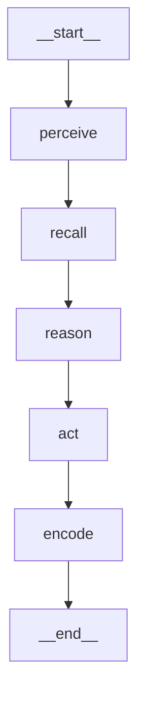

# 用一个狼人杀 AI 项目，从零学会 LangGraph

> 本文用本仓库里“AI 操控 AI 玩家”的真实代码当教材，带你把 **LangGraph** 的核心用法学一遍：
> 状态图 `StateGraph`、状态 schema 与 reducer、节点 `add_node`、边 `add_edge`/`START`/`END`、
> 编译 `compile`、执行 `invoke`、可观测（节点轨迹 / Mermaid），以及如何把一个 **LLM（langchain）**
> 作为图里的一个节点接进来。文中**每个相关文件、每个函数都会完整展示并逐一讲解**。

阅读前置：会 Python 即可，不需要先懂 LangGraph。代码可直接在 `apps/backend` 下运行：
`uv run python -m app.cli.autoplay --game werewolf --players 8 --policy langgraph`。

---

## 0. 一句话理解我们要做的事

狼人杀里每个 AI 角色“轮到自己时”要做一个决策（查验谁 / 刀谁 / 投谁）。我们把这个“想一步”的过程
拆成 5 个阶段——**感知 → 召回 → 推理 → 行动 → 编码**——再用 LangGraph 把这 5 步连成一张图，
让图的执行器去驱动它。这正是 LangGraph 最擅长的事：**把“带状态的多步流程”建成节点和边**。

```
__start__ → perceive → recall → reason → act → encode → __end__
              感知       召回      推理     行动    编码
```

---

## 1. LangGraph 的 5 个核心概念（先记住）

| 概念 | 是什么 | 本项目对应 |
|---|---|---|
| **State** | 在节点间流动的共享状态（一个 TypedDict） | `DecisionState`：装决策上下文 `ctx` 和轨迹 `trace` |
| **Reducer** | 多个节点写同一个键时怎么合并 | `trace` 用 `operator.add` 累加节点名 |
| **Node** | 一个函数：读 state、返回要更新的部分 | `perceive/recall/reason/act/encode` |
| **Edge** | 节点间的连线（含特殊的 `START`/`END`） | 线性 5 连边 |
| **compile / invoke** | 把图编译成可执行对象，再用输入跑它 | `build_decision_app()` / `app.invoke(...)` |

下面用项目代码把这 5 个概念一一落地。

---

## 2. 节点的“世界接口”：引擎给了什么

LangGraph 的节点要做有意义的事，得先有“环境”。本项目的游戏引擎（纯逻辑、不依赖 LLM）给节点提供两类东西：
**当前合法行动**和**行动合法性校验**。先看这两个签名（来自 `app/engine/engine.py`）：

```python
    def legal_actions(self, state: GameState, seat: Seat) -> list[Action]:
        if state.finished or not seat.alive:
            return []
        phase = state.definition.phase(state.phase)
```
`legal_actions(state, seat)` 返回“此刻这个席位能做的所有合法行动”——这是 `perceive` 节点的输入来源。

```python
    def _is_legal(self, state: GameState, action: Action) -> bool:
        legal = self.legal_actions(state, state.seat(action.seat))
        for la in legal:
            if la.type == action.type and tuple(la.targets) == tuple(action.targets):
                return True
        return False
```
`_is_legal(state, action)` 用来在 `act` 节点做**合法性双保险**：哪怕 LLM“幻觉”出一个非法动作，也会被挡下。

行动 / 席位 / 状态的数据类型（`app/engine/types.py`）——节点读写的都是这些纯数据对象：
```python
@dataclass
class Action:
    """一次行动意图。引擎对人类/AI 来源无感知（§11）。"""

    seat: int
    type: str  # 原语名，或 "pass"（跳过可选行动）
    targets: tuple[int, ...] = ()
    channel: Optional[str] = None
    extra: dict[str, Any] = field(default_factory=dict)


@dataclass
class Event:
    """一条 session_event（已带 visibility，§5）。"""

    seq: int
    phase: str
    round: int
    actor: Optional[int]  # seat_id 或 None（系统事件）
    action: str
    payload: dict[str, Any] = field(default_factory=dict)
    visibility: Visibility = Visibility.PUBLIC
    audience: tuple[int, ...] = ()  # private/faction 时的可见席位集合（空=按 visibility 规则推导）

```

> 关键设计：引擎**不认识** LLM 或 LangGraph。人类点击和 AI 推理最后都变成一个 `Action` 交给引擎，
> 所以 LangGraph 只活在“AI 决策”这一层，可插拔、可单测。

---

## 3. 决策上下文与 5 个节点的逻辑（`app/agents/decision_graph.py`）

在把节点连成图之前，先定义“节点之间传递什么”和“每个节点做什么”。本文件用**纯 Python** 实现了
这套逻辑（不依赖 langgraph），LangGraph 版会直接复用它——这样图与非图两种执行方式行为完全一致。全文如下：

```python
"""AI 玩家决策子图（Start.md §10）。

对每个需要行动的 AI 角色调用一次的内层决策子图：
    感知(Perceive) → 召回(Recall) → 推理(Reason) → 行动(Act) → 编码(Encode)

本模块提供两种策略：
- ``RandomPolicy``：从合法行动里随机挑一个（基线，确定性可控）。
- ``HeuristicPolicy``：跑完整决策子图，用"心证(STM)+羁绊偏置"做出优于随机的决策
  （狼不刀队友、预言家查未知、票投最可疑），无需 LLM 即可运行。

``DecisionGraph`` 是子图编排器：把五个节点串起来执行。真实部署可把 ``Reasoner`` 换成
LLM 推理节点（注入 persona/traits + 召回记忆构造 prompt），或在 langgraph 上重建同构子图；
节点契约与"合法性双保险"（产出行动必过引擎 legal_actions 校验）保持不变（§10 / §15）。
"""

from __future__ import annotations

import random
from dataclasses import dataclass, field
from typing import Optional, Protocol

from app.engine import Action, GameEngine, GameState, Seat
from app.memory.bonds import BondGraph
from app.memory.stm import Belief


class Policy(Protocol):
    """行动策略：给定状态与席位，返回一个合法行动。"""

    def decide(self, engine: GameEngine, state: GameState, seat: Seat) -> Optional[Action]: ...


class RandomPolicy:
    """从引擎给出的合法行动里随机挑一个（确定性可控，便于复盘）。"""

    def __init__(self, seed: Optional[int] = None) -> None:
        self._rng = random.Random(seed)

    def decide(self, engine: GameEngine, state: GameState, seat: Seat) -> Optional[Action]:
        legal = engine.legal_actions(state, seat)
        if not legal:
            return None
        return self._rng.choice(legal)


# --------------------------------------------------------------------------- #
# 决策子图：上下文 + 节点 + 编排器
# --------------------------------------------------------------------------- #
@dataclass
class GraphContext:
    engine: GameEngine
    state: GameState
    seat: Seat
    beliefs: dict  # seat_id -> Belief（本策略实例跨回合累积的心证）
    bonds: Optional[BondGraph] = None
    rng: random.Random = field(default_factory=random.Random)
    # 工作字段
    legal: list = field(default_factory=list)
    wolf_mates: set = field(default_factory=set)
    bias: dict = field(default_factory=dict)
    chosen: Optional[Action] = None


class Reasoner(Protocol):
    """推理节点：给定上下文与一个候选行动，返回打分（越高越优先）。"""

    def score(self, ctx: GraphContext, action: Action) -> float: ...


class HeuristicReasoner:
    """无需 LLM 的启发式推理：依据阵营、心证、羁绊偏置给候选行动打分。"""

    def _enemy_factions(self, ctx: GraphContext) -> set:
        return {f for f in ctx.state.definition.factions if f != ctx.seat.faction}

    def _suspicion(self, ctx: GraphContext, target: int) -> float:
        b = ctx.beliefs.get(target)
        if not b:
            return 0.0
        s = 0.0
        if b.suspected_faction in self._enemy_factions(ctx):
            s += 1.0
        s += (-b.trust) / 100.0  # 越不信任越可疑
        return s

    def score(self, ctx: GraphContext, action: Action) -> float:
        me = ctx.seat
        if action.type == "pass":
            return 0.0
        if not action.targets:
            return 0.1  # speak 等无目标行动，低优先
        target = action.targets[0]
        bias = ctx.bias.get(target, {})
        affinity = bias.get("affinity", 0)
        b = ctx.beliefs.get(target)
        trust = b.trust if b else 0
        susp = self._suspicion(ctx, target)

        if action.type == "eliminate":
            if me.faction == "werewolf":
                if target in ctx.wolf_mates:
                    return -999.0  # 绝不刀队友
                # 优先刀：低好感 / 我方不信任的威胁
                return 50.0 + (-affinity) / 10.0 + (-trust) / 10.0
            # 女巫毒药等：毒最可疑的敌人
            return 25.0 + susp * 15.0 + (-trust) / 10.0
        if action.type == "investigate":
            if b is None:
                return 40.0  # 优先查未知
            return 18.0 + (-trust) / 10.0
        if action.type == "vote":
            if me.faction == "werewolf" and target in ctx.wolf_mates:
                return -999.0  # 不票队友
            return 20.0 + susp * 18.0 + (-trust) / 10.0 + (-affinity) / 12.0
        if action.type == "protect":
            return 20.0 + trust / 10.0 + affinity / 10.0  # 护信任的/好感高的
        if action.type == "nominate":
            return 12.0 + susp * 10.0 + (-trust) / 10.0
        return 1.0


class DecisionGraph:
    """决策子图编排器：感知→召回→推理→行动→编码。

    纯 Python 执行（无外部依赖即可运行）。如需可视化/可观测的图，可在 langgraph 上重建同构子图，
    把下列方法登记为节点；本编排器即其参考实现。
    """

    def __init__(self, reasoner: Optional[Reasoner] = None) -> None:
        self.reasoner = reasoner or HeuristicReasoner()

    def run(self, ctx: GraphContext) -> Optional[Action]:
        self.perceive(ctx)
        self.recall(ctx)
        self.reason(ctx)
        action = self.act(ctx)
        self.encode(ctx)
        return action

    # ① 感知：拉合法行动、识别狼队友（狼人互认）
    def perceive(self, ctx: GraphContext) -> None:
        ctx.legal = ctx.engine.legal_actions(ctx.state, ctx.seat)
        if ctx.seat.faction == "werewolf":
            ctx.wolf_mates = {
                s.seat_id for s in ctx.state.alive_seats() if s.faction == "werewolf"
            }

    # ② 召回：扫描"自己可见的"私有事件更新心证 + 取羁绊偏置
    def recall(self, ctx: GraphContext) -> None:
        me = ctx.seat.seat_id
        for ev in ctx.state.log:
            if ev.action == "investigate_result" and ev.actor == me:
                tgt = ev.payload.get("target")
                val = ev.payload.get("value")
                bel = ctx.beliefs.get(tgt) or Belief(seat=tgt)
                if ev.payload.get("reveals") == "faction":
                    bel.suspected_faction = val
                    bel.trust = -80 if val == "werewolf" else 60
                ctx.beliefs[tgt] = bel
        if ctx.bonds is not None:
            present = {s.seat_id: s.seat_id for s in ctx.state.alive_seats()}
            ctx.bias = ctx.bonds.to_behavior_bias(me, present)

    # ③ 推理：给每个合法行动打分
    def reason(self, ctx: GraphContext) -> None:
        ctx._scores = [(self.reasoner.score(ctx, a), a) for a in ctx.legal]  # type: ignore[attr-defined]

    # ④ 行动：取最高分（同分确定性随机），合法性双保险后落地
    def act(self, ctx: GraphContext) -> Optional[Action]:
        if not ctx.legal:
            return None
        scores = getattr(ctx, "_scores", [(0.0, a) for a in ctx.legal])
        best = max(s for s, _ in scores)
        top = [a for s, a in scores if s == best]
        chosen = top[0] if len(top) == 1 else ctx.rng.choice(top)
        # 合法性双保险：必须在引擎给出的合法集合内，否则回退安全默认
        if not ctx.engine._is_legal(ctx.state, chosen):
            chosen = ctx.legal[0]
        ctx.chosen = chosen
        return chosen

    # ⑤ 编码：把本回合形成的心证写回（此实例跨回合记忆）
    def encode(self, ctx: GraphContext) -> None:
        pass  # 心证已就地更新于 ctx.beliefs（HeuristicPolicy 持有），此处可扩展为写 STM/LTM


class HeuristicPolicy:
    """跑完整决策子图的策略；持有跨回合心证，可选注入羁绊图。"""

    def __init__(
        self,
        seed: Optional[int] = None,
        bonds: Optional[BondGraph] = None,
        reasoner: Optional[Reasoner] = None,
    ) -> None:
        self._rng = random.Random(seed)
        self._beliefs: dict = {}
        self._bonds = bonds
        self._graph = DecisionGraph(reasoner)

    def decide(self, engine: GameEngine, state: GameState, seat: Seat) -> Optional[Action]:
        ctx = GraphContext(
            engine=engine,
            state=state,
            seat=seat,
            beliefs=self._beliefs,
            bonds=self._bonds,
            rng=self._rng,
        )
        return self._graph.run(ctx)

    @property
    def beliefs(self) -> dict:
        return self._beliefs


class AIPlayer:
    """绑定一张人物卡的 AI 玩家；默认由 LLM 决策链操控（langchain + LangGraph）。"""

    def __init__(self, character_id: int, policy: Optional[Policy] = None) -> None:
        self.character_id = character_id
        if policy is None:
            from app.agents.llm import LLMPolicy  # 懒导入避免循环

            policy = LLMPolicy()
        self.policy = policy

    def act(self, engine: GameEngine, state: GameState, seat: Seat) -> Optional[Action]:
        return self.policy.decide(engine, state, seat)
```

逐部分讲解：

- **`Policy` 协议**：所有策略（随机 / 启发式 / LLM）的统一接口 `decide(engine, state, seat) -> Action|None`，让它们能互换。这与 LangGraph 无关，但保证了“换大脑不换骨架”。
- **`RandomPolicy`**：最简基线，从合法行动里随机选，用于烟测和对照。
- **`GraphContext`**：**这就是将来要塞进 LangGraph State 的对象**。它把一次决策需要的一切打包：引擎、牌局状态、当前席位、跨回合心证 `beliefs`、羁绊图 `bonds`、随机源，以及工作字段 `legal`（合法行动）、`wolf_mates`（狼队友）、`bias`（羁绊偏置）、`chosen`（最终选择）。节点们就是不断往这个对象上读写。
- **`Reasoner` 协议 + `HeuristicReasoner`**：`reason` 节点的“打分器”。`score(ctx, action)` 给每个候选打分；启发式版本编码了狼人杀常识（狼绝不刀队友→ -999；预言家优先查未知；投票投最可疑）。**这正是之后会被 LLM 替换的接缝**。
- **`DecisionGraph`**：把 5 个节点写成 5 个方法，`run()` 顺序调用它们——这是“不用 langgraph 的参考实现”：
  - `perceive`：拿 `legal_actions`，若自己是狼则记下狼队友；
  - `recall`：扫自己**可见的**私有事件（如预言家自己的查验结果）更新心证，并取羁绊偏置；
  - `reason`：对每个合法行动调 `reasoner.score`，存进 `ctx._scores`；
  - `act`：取最高分，**再过 `engine._is_legal` 双保险**，写入 `ctx.chosen`；
  - `encode`：把本回合形成的心证留在 `ctx.beliefs`（策略实例跨回合持有）。
- **`HeuristicPolicy`**：持有跨回合心证，跑 `DecisionGraph`，无 LLM 也能把整局玩完。
- **`AIPlayer`**：绑定人物卡的 AI 玩家，默认策略是 LLM（见第 6 节）。

记住这张表——LangGraph 版会把这 5 个方法**一对一**变成图节点：

| 方法 | 角色 | 读 | 写 |
|---|---|---|---|
| `perceive` | 感知 | engine | `ctx.legal`, `ctx.wolf_mates` |
| `recall` | 召回 | state.log, bonds | `ctx.beliefs`, `ctx.bias` |
| `reason` | 推理 | reasoner | `ctx._scores` |
| `act` | 行动 | `_is_legal` | `ctx.chosen` |
| `encode` | 编码 | — | `ctx.beliefs` |

---

## 4. 用 LangGraph 把 5 个节点连成图（`app/agents/langgraph_graph.py`）

这是**本文的核心**。全文如下，之后逐个 API 讲解：

```python
"""用 LangGraph 实现的 AI 决策子图（Start.md §10 内层子图）。

这是 ``decision_graph.DecisionGraph`` 的 **LangGraph 版**：把同一套五节点
``感知 → 召回 → 推理 → 行动 → 编码`` 建成一张真正的 ``StateGraph``（节点=Node、转移=Edge），
由 langgraph 的图执行器驱动。相比纯 Python 编排器，好处是：图可观测（节点轨迹）、可扩展
（条件边/重试/并行）、与未来"外层游戏编排图"同构。

- langgraph 为**可选依赖**（`uv sync --extra ai`）：本模块在构图时才导入，未安装则给出明确提示，
  其余模块（引擎/记忆/联机/CLI 的 random/heuristic 策略）不受影响。
- 推理节点默认复用 ``HeuristicReasoner``（无需 LLM 即可跑），**LLM 推理就替换这一个节点**：
  把 ``Reasoner`` 换成基于 langchain-core 的 LLM 实现即可，图结构、合法性双保险都不变。
- 节点逻辑直接复用 ``DecisionGraph`` 的 perceive/recall/reason/act/encode 方法，确保两版行为一致。
"""
from __future__ import annotations

import operator
import random
from typing import Annotated, Any, Optional, TypedDict

from app.agents.decision_graph import DecisionGraph, GraphContext, Reasoner
from app.engine import Action, GameEngine, GameState, Seat
from app.memory.bonds import BondGraph


def langgraph_available() -> bool:
    try:
        import langgraph  # noqa: F401

        return True
    except ImportError:
        return False


class DecisionState(TypedDict):
    """图在节点间传递的状态。

    - ``ctx``：决策上下文对象（引擎/状态/席位/心证/打分/选择），各节点就地读写它。
    - ``trace``：节点执行轨迹，用累加 reducer 记录，便于观测"图确实按 5 节点跑过"。
    """

    ctx: Any
    trace: Annotated[list, operator.add]


def build_decision_app(reasoner: Optional[Reasoner] = None):
    """构造并编译 LangGraph 决策子图（懒导入 langgraph）。返回可 ``invoke`` 的编译图。"""
    try:
        from langgraph.graph import END, START, StateGraph
    except ImportError as e:  # pragma: no cover
        raise ImportError("LangGraph 未安装，请先执行 `uv sync --extra ai`") from e

    dg = DecisionGraph(reasoner)  # 复用同一套节点逻辑

    def perceive(state: DecisionState) -> dict:
        dg.perceive(state["ctx"])
        return {"trace": ["perceive"]}

    def recall(state: DecisionState) -> dict:
        dg.recall(state["ctx"])
        return {"trace": ["recall"]}

    def reason(state: DecisionState) -> dict:
        dg.reason(state["ctx"])
        return {"trace": ["reason"]}

    def act(state: DecisionState) -> dict:
        dg.act(state["ctx"])  # 设置 ctx.chosen，并已过引擎合法性双保险
        return {"trace": ["act"]}

    def encode(state: DecisionState) -> dict:
        dg.encode(state["ctx"])
        return {"trace": ["encode"]}

    g = StateGraph(DecisionState)
    g.add_node("perceive", perceive)
    g.add_node("recall", recall)
    g.add_node("reason", reason)
    g.add_node("act", act)
    g.add_node("encode", encode)
    # 线性子图：感知 → 召回 → 推理 → 行动 → 编码
    g.add_edge(START, "perceive")
    g.add_edge("perceive", "recall")
    g.add_edge("recall", "reason")
    g.add_edge("reason", "act")
    g.add_edge("act", "encode")
    g.add_edge("encode", END)
    return g.compile()


class LangGraphPolicy:
    """基于 LangGraph 决策子图的策略；持有跨回合心证，可选注入羁绊与自定义推理节点。"""

    def __init__(
        self,
        seed: Optional[int] = None,
        bonds: Optional[BondGraph] = None,
        reasoner: Optional[Reasoner] = None,
    ) -> None:
        self._app = build_decision_app(reasoner)  # 未装 langgraph 会在此抛 ImportError
        self._rng = random.Random(seed)
        self._beliefs: dict = {}
        self._bonds = bonds
        self.last_trace: list = []

    def decide(self, engine: GameEngine, state: GameState, seat: Seat) -> Optional[Action]:
        ctx = GraphContext(
            engine=engine, state=state, seat=seat,
            beliefs=self._beliefs, bonds=self._bonds, rng=self._rng,
        )
        out = self._app.invoke({"ctx": ctx, "trace": []})
        self.last_trace = out["trace"]
        return ctx.chosen

    @property
    def beliefs(self) -> dict:
        return self._beliefs
```

### 4.1 定义 State（图在节点间传递的数据）
```python
class DecisionState(TypedDict):
    ctx: Any                               # 决策上下文对象，各节点就地读写
    trace: Annotated[list, operator.add]   # 节点轨迹，用累加 reducer 合并
```
- LangGraph 要求声明一个 **State 类型**（这里用 `TypedDict`）。节点返回“部分更新”，由图把它合并进 State。
- `ctx` 是普通键：默认 reducer 是“覆盖”。我们从不更新它，所以整张图共享**同一个 `ctx` 对象引用**，节点对它的就地修改自然在后续节点可见。
- `trace` 用 `Annotated[list, operator.add]` 声明 **reducer**：每个节点返回 `{"trace": ["名字"]}`，LangGraph 用 `operator.add` 把它们拼起来 → 最终 `[perceive, recall, reason, act, encode]`。**这是教学里最该体会的点：reducer 决定“多次写同一键如何合并”。**

### 4.2 把方法包成节点
```python
dg = DecisionGraph(reasoner)          # 复用第 3 节的节点逻辑
def perceive(state): dg.perceive(state["ctx"]); return {"trace": ["perceive"]}
...
```
- 节点是**纯函数**：入参是当前 State，返回一个 dict（只含要更新的键）。
- 我们让节点调用 `DecisionGraph` 的对应方法去改 `ctx`，再返回 `{"trace":[名字]}` 记录轨迹。因此**图版和纯 Python 版共用同一套节点逻辑，行为一致**。

### 4.3 建图、连边、编译
```python
g = StateGraph(DecisionState)
g.add_node("perceive", perceive)      # 注册节点
...
g.add_edge(START, "perceive")         # START 是入口虚拟节点
g.add_edge("perceive", "recall")      # 普通边：固定下一步
...
g.add_edge("encode", END)             # END 是出口虚拟节点
return g.compile()                    # 编译成可执行图
```
- `StateGraph(State类型)`：创建一张图并告诉它状态长什么样。
- `add_node(名字, 函数)`：注册节点。
- `add_edge(a, b)`：a 跑完固定去 b；`START`/`END` 是 LangGraph 内置的入口 / 出口。
- `compile()`：把图“定稿”成一个可 `invoke` 的对象（编译期会校验图结构，比如有没有悬空节点）。

### 4.4 执行图
```python
out = self._app.invoke({"ctx": ctx, "trace": []})
self.last_trace = out["trace"]        # ["perceive","recall","reason","act","encode"]
return ctx.chosen                     # 节点们已把决策写进 ctx
```
- `invoke(初始State)`：从 `START` 开始按边推进，依次执行节点、合并更新，到 `END` 返回最终 State。
- 我们的“结果”（选了哪个行动）写在共享的 `ctx.chosen` 上；`trace` 则证明图确实按 5 节点跑过。

### 4.5 优雅降级
`langgraph_available()` 与函数内 `import` 让 langgraph 成为**可选导入**：没装也不影响其它模块导入，
只有真正 `build_decision_app()` 时才需要它。这是给可选依赖做“懒导入”的常见手法。

---

## 5. 把“推理”节点接上 LLM（`app/agents/llm.py`）

到这里图已经能跑（用启发式打分）。现在做最关键的升级：**让 `reason` 节点改由一个 LLM 决策**——
这正是“AI 操控 AI 角色”。手法是 langchain 的 **LCEL 链**：`提示词模板 | 聊天模型 | 输出解析器`。全文如下：

```python
"""LLM 驱动的 AI 决策（Start.md §10 推理节点 · langchain）。

整个平台的核心是"AI 操控 AI 角色"——每个 AI 角色的行动由 **LLM 决策链**产生。本模块用
**langchain-core** 把决策建成一条标准链：``ChatPromptTemplate | ChatModel | OutputParser``。

- 决策链是必经路径：感知/召回得到的情境（合法行动、心证、羁绊偏置、人物卡 persona）渲染进 prompt，
  交给 ChatModel 选出行动编号，再由引擎做合法性双保险（§10）。
- ChatModel 可注入：
  - 默认 ``LocalHeuristicChatModel``——一个**真实的 langchain ``BaseChatModel``**，无需 API key、可离线确定性运行
    （读取 prompt 里每个候选的"提示分"挑最优）；保证无网络也能整局跑通、可单测。
  - 配置 ``XBOARD_LLM_PROVIDER=openai`` 且装了 ``langchain-openai`` 时，``get_chat_model`` 返回 ``ChatOpenAI``，
    决策链其余部分**完全不变**——这就是"换成真模型即真 LLM 对局"。
- 与 LangGraph 协同：``LLMReasoner`` 实现 ``Reasoner`` 协议，直接插进 LangGraph/纯 Python 决策子图的 reason 节点。
"""
from __future__ import annotations

import os
import re
from typing import Any, Optional

from langchain_core.language_models.chat_models import BaseChatModel
from langchain_core.messages import AIMessage, BaseMessage
from langchain_core.outputs import ChatGeneration, ChatResult
from langchain_core.output_parsers import StrOutputParser
from langchain_core.prompts import ChatPromptTemplate

from app.agents.decision_graph import GraphContext, HeuristicReasoner, Reasoner
from app.engine import Action


# --------------------------------------------------------------------------- #
# 默认离线模型：一个真实的 langchain BaseChatModel
# --------------------------------------------------------------------------- #
class LocalHeuristicChatModel(BaseChatModel):
    """无需 API key 的本地 ChatModel：读 prompt 里候选的"提示分"，回复最优编号。

    它是合法的 langchain ``BaseChatModel``（可进任何 LCEL 链），让整条 LLM 决策链在离线、确定性、
    可单测的前提下跑通；换成 ChatOpenAI 等真实模型时，链路与下游解析完全不变。
    """

    @property
    def _llm_type(self) -> str:
        return "local-heuristic"

    def _generate(
        self,
        messages: list[BaseMessage],
        stop: Optional[list[str]] = None,
        run_manager: Any = None,
        **kwargs: Any,
    ) -> ChatResult:
        text = messages[-1].content if messages else ""
        idx = _argmax_hint(text if isinstance(text, str) else str(text))
        msg = AIMessage(content=str(idx))
        return ChatResult(generations=[ChatGeneration(message=msg)])


# 解析候选块里形如 "[i] ... 提示分 12.5" 的行，返回提示分最高的编号
_CAND = re.compile(r"\[(\d+)\][^\n]*?提示分\s*([-\d.]+)")


def _argmax_hint(prompt_text: str) -> int:
    best_i, best_s = 0, float("-inf")
    for m in _CAND.finditer(prompt_text):
        i, s = int(m.group(1)), float(m.group(2))
        if s > best_s:
            best_i, best_s = i, s
    return best_i


def get_chat_model(model: Optional[BaseChatModel] = None) -> BaseChatModel:
    """决策用 ChatModel 工厂。

    - 显式传入 → 用它。
    - 环境 ``XBOARD_LLM_PROVIDER=openai`` 且装了 langchain-openai → ``ChatOpenAI``（读 ``XBOARD_LLM_MODEL``）。
    - 否则 → 离线 ``LocalHeuristicChatModel``（默认，保证无 key 可运行）。
    """
    if model is not None:
        return model
    provider = os.getenv("XBOARD_LLM_PROVIDER", "").lower()
    if provider == "openai":
        try:
            from langchain_openai import ChatOpenAI

            return ChatOpenAI(model=os.getenv("XBOARD_LLM_MODEL", "gpt-4o-mini"), temperature=0.7)
        except ImportError:
            pass
    return LocalHeuristicChatModel()


# --------------------------------------------------------------------------- #
# 决策链 + Reasoner
# --------------------------------------------------------------------------- #
_SYSTEM = (
    "你是社交推理桌游里的一名 AI 玩家：{persona}。"
    "你只能从给定候选行动里选择一个，目标是为自己的阵营取得胜利。"
    "综合你的身份、对其他玩家的心证、与他人的羁绊来判断。只回复你选择的候选编号（一个整数），不要解释。"
)
_HUMAN = (
    "阶段：{phase}　回合：{round}\n"
    "你的身份：席位#{seat} {role}/{faction}\n"
    "心证（对他人的判断）：{beliefs}\n"
    "羁绊偏置：{bias}\n"
    "召回的相关记忆：{memories}\n"
    "候选行动：\n{candidates}\n"
    "请只回复最佳候选的编号。"
)


class LLMReasoner:
    """用 langchain 决策链选行动的 Reasoner。

    实现 ``Reasoner.score``：每次决策（每个 ctx）只调用一次 LLM 选出编号并缓存，
    被选中的行动给高分、其余 0 分；落地仍由引擎合法性双保险。解析失败回退启发式最优。
    """

    def __init__(
        self,
        model: Optional[BaseChatModel] = None,
        persona: str = "理性、谨慎、以阵营胜利为目标",
        ltm: Any = None,
    ) -> None:
        self.model = get_chat_model(model)
        self.persona = persona
        self.ltm = ltm
        self._heur = HeuristicReasoner()  # 提供候选特征/提示分 + 兜底
        prompt = ChatPromptTemplate.from_messages([("system", _SYSTEM), ("human", _HUMAN)])
        self.chain = prompt | self.model | StrOutputParser()

    # ---- Reasoner 协议 ----
    def score(self, ctx: GraphContext, action: Action) -> float:
        pick = getattr(ctx, "_llm_pick", None)
        if pick is None or getattr(ctx, "_llm_pick_for", None) is not ctx.legal:
            pick = self._choose(ctx)
            ctx._llm_pick = pick
            ctx._llm_pick_for = ctx.legal
        return 1.0 if action is pick else 0.0

    # ---- 调用决策链 ----
    def _choose(self, ctx: GraphContext) -> Optional[Action]:
        legal = ctx.legal
        if not legal:
            return None
        cand_lines = []
        for i, a in enumerate(legal):
            hint = self._heur.score(ctx, a)
            tgt = f" 目标#{a.targets[0]}" if a.targets else ""
            cand_lines.append(f"[{i}] {a.type}{tgt} | 提示分 {round(hint, 1)}")
        memories = ""
        if self.ltm is not None:
            mem = self.ltm.recall(f"阶段 {ctx.state.phase} 谁可疑", top_k=3,
                                  character_id=ctx.seat.seat_id)
            memories = "；".join(m.content for m in mem) or "无"
        out = self.chain.invoke({
            "persona": self.persona,
            "phase": ctx.state.phase,
            "round": ctx.state.round,
            "seat": ctx.seat.seat_id,
            "role": ctx.seat.role,
            "faction": ctx.seat.faction,
            "beliefs": _fmt_beliefs(ctx),
            "bias": ctx.bias or "无",
            "memories": memories or "无",
            "candidates": "\n".join(cand_lines),
        })
        idx = _first_int(out)
        if idx is None or not (0 <= idx < len(legal)):
            # 回退：启发式最优
            return max(legal, key=lambda a: self._heur.score(ctx, a))
        return legal[idx]


def _fmt_beliefs(ctx: GraphContext) -> str:
    if not ctx.beliefs:
        return "无"
    parts = []
    for seat, b in sorted(ctx.beliefs.items()):
        parts.append(f"#{seat}:{b.suspected_faction or '?'}(信任{b.trust})")
    return "，".join(parts)


def _first_int(text: str) -> Optional[int]:
    m = re.search(r"-?\d+", text or "")
    return int(m.group()) if m else None


# --------------------------------------------------------------------------- #
# LLM 策略：默认走 LangGraph 决策子图 + LLM 推理节点
# --------------------------------------------------------------------------- #
class LLMPolicy:
    """AI 角色的默认策略：LLM（langchain 决策链）驱动，跑在 LangGraph 决策子图里。

    langgraph 可用时走 LangGraph 子图（可观测/可扩展）；否则回退纯 Python 决策子图。
    无论哪种，推理节点都用 ``LLMReasoner``，即 AI 角色由 LLM 操控。
    """

    def __init__(
        self,
        model: Optional[BaseChatModel] = None,
        seed: Optional[int] = None,
        bonds: Any = None,
        persona: str = "理性、谨慎、以阵营胜利为目标",
        ltm: Any = None,
        use_langgraph: bool = True,
    ) -> None:
        import random

        self._reasoner = LLMReasoner(model=model, persona=persona, ltm=ltm)
        self._rng = random.Random(seed)
        self._beliefs: dict = {}
        self._bonds = bonds
        self.last_trace: list = []

        self._app = None
        self._graph = None
        from app.agents.langgraph_graph import build_decision_app, langgraph_available

        if use_langgraph and langgraph_available():
            self._app = build_decision_app(self._reasoner)
        else:
            from app.agents.decision_graph import DecisionGraph

            self._graph = DecisionGraph(self._reasoner)

    def decide(self, engine, state, seat) -> Optional[Action]:
        ctx = GraphContext(
            engine=engine, state=state, seat=seat,
            beliefs=self._beliefs, bonds=self._bonds, rng=self._rng,
        )
        if self._app is not None:
            out = self._app.invoke({"ctx": ctx, "trace": []})
            self.last_trace = out["trace"]
        else:
            self._graph.run(ctx)
        return ctx.chosen

    @property
    def beliefs(self) -> dict:
        return self._beliefs
```

逐部分讲解：

- **`LocalHeuristicChatModel(BaseChatModel)`**：一个**真正的 langchain 聊天模型**，但离线、确定性——读 prompt 里每个候选的“提示分”挑最优。作用是让整条 LLM 链路**无需 API key 就能跑通和单测**；换成真实模型时链路其它部分一字不改。实现 `BaseChatModel` 只需写 `_generate` 与 `_llm_type`。
- **`get_chat_model()`**：模型工厂。设了 `XBOARD_LLM_PROVIDER=openai` 且装了 `langchain-openai` → 用 `ChatOpenAI`；否则用离线模型。**这就是“换大脑”的开关**。
- **`LLMReasoner`**：把决策链包成第 3 节里的 `Reasoner` 接口：
  - 构造时建链：`prompt | self.model | StrOutputParser()`（一个 langchain `RunnableSequence`）；
  - `score()`：每次决策只调一次 LLM（缓存在 `ctx._llm_pick`），被选中的行动给 1 分、其余 0 分；
  - `_choose()`：把情境（身份、候选行动+提示分、心证、羁绊偏置、召回的记忆、人物卡 persona）渲染进 prompt，`chain.invoke(...)` 拿到模型回复，解析出编号；越界 / 失败**回退启发式最优**（鲁棒）。
- **`LLMPolicy`**：AI 角色的默认策略。它**默认就在第 4 节的 LangGraph 图里跑**（`build_decision_app(self._reasoner)`），只是把 reason 节点的打分器换成了 `LLMReasoner`；langgraph 不可用时回退纯 Python 子图。

> 教学要点：**LLM 在 LangGraph 里只是“一个节点内部的一次 `chain.invoke`”**。图负责流程编排，链负责一次推理，
> 两者职责分明。想接真模型？只改 `get_chat_model` 返回的对象，图与节点都不动。

---

## 6. 装配与导出（`app/agents/__init__.py`）

```python
"""AI 玩家与决策子图编排（Start.md §10）。

核心：AI 角色由 **LLM 决策链（langchain）** 操控，跑在 **LangGraph 决策子图**里。
- ``LLMPolicy`` / ``LLMReasoner`` / ``get_chat_model``：LLM 驱动决策（默认 AI 策略）。
- ``LangGraphPolicy`` / ``build_decision_app``：LangGraph StateGraph 决策子图。
- ``HeuristicPolicy`` / ``RandomPolicy``：无 LLM 的纯 Python 策略（基线/兜底/测试）。
- ``Reasoner``：推理节点接缝（HeuristicReasoner / LLMReasoner）。
"""

from app.agents.decision_graph import (
    AIPlayer,
    DecisionGraph,
    GraphContext,
    HeuristicPolicy,
    HeuristicReasoner,
    Policy,
    RandomPolicy,
    Reasoner,
)
from app.agents.langgraph_graph import (
    DecisionState,
    LangGraphPolicy,
    build_decision_app,
    langgraph_available,
)
from app.agents.llm import (
    LLMPolicy,
    LLMReasoner,
    LocalHeuristicChatModel,
    get_chat_model,
)

__all__ = [
    "DecisionGraph",
    "AIPlayer",
    "Policy",
    "RandomPolicy",
    "HeuristicPolicy",
    "HeuristicReasoner",
    "Reasoner",
    "GraphContext",
    "LangGraphPolicy",
    "build_decision_app",
    "langgraph_available",
    "DecisionState",
    "LLMPolicy",
    "LLMReasoner",
    "LocalHeuristicChatModel",
    "get_chat_model",
]
```

把三种载体（纯 Python 子图 / LangGraph 子图 / LLM 策略）统一导出。它们都满足 `Policy` 协议，可在 CLI、
联机、测试里互换——这是“骨架稳定、大脑可换”的收口。

---

## 7. 跑起来 & 看得见

```bash
cd apps/backend && uv sync          # 默认装 langchain-core + langgraph
# 三种图执行方式，任选：
uv run python -m app.cli.autoplay --policy langgraph   # LangGraph + 启发式推理
uv run python -m app.cli.autoplay --policy llm         # LangGraph + LLM 决策链（默认离线模型）
```

**观测节点轨迹**（证明图按 5 节点跑过）：
```python
pol = LangGraphPolicy(seed=1); pol.decide(engine, state, seat)
print(pol.last_trace)   # ["perceive","recall","reason","act","encode"]
```

**让图画出自己**（LangGraph 自带 Mermaid 导出）：
```python
app = build_decision_app()
print(app.get_graph().draw_mermaid())
```


---

## 8. 再进一步：LangGraph 还能怎么用

本项目用的是最简单的**线性图**。LangGraph 的威力在这些地方（可作为练习继续扩展本项目）：

- **条件边 `add_conditional_edges`**：例如 `act` 后判断 LLM 产出是否合法，非法则连回 `reason` **重试**，而不是直接回退。
- **循环**：把“外层游戏流程”也建成图——节点=游戏阶段（night/day_vote…），边=阶段转移，形成回合循环（Start.md §10 的外层图）。
- **`interrupt` / 人审**：在关键决策（投票）前中断，等人类确认再继续——天然支持人机混局。
- **检查点（checkpointer）**：给 `compile(checkpointer=...)` 加持久化，实现断线重连、回放。
- **并行节点**：多个 AI 角色的决策子图并行执行。

---

## 9. 项目文件全景（每个文件的职责）

本文聚焦 LangGraph 相关的 `agents` 层并展示了其全部源码；为完整起见，列出整个后端每个文件的职责：

| 文件 | 职责（取自模块文档） |
|---|---|
| `app/__init__.py` | AI Tabletop Platform backend package. |
| `app/agents/__init__.py` | AI 玩家与决策子图编排（Start.md §10）。 |
| `app/agents/decision_graph.py` | AI 玩家决策子图（Start.md §10）。 |
| `app/agents/langgraph_graph.py` | 用 LangGraph 实现的 AI 决策子图（Start.md §10 内层子图）。 |
| `app/agents/llm.py` | LLM 驱动的 AI 决策（Start.md §10 推理节点 · langchain）。 |
| `app/api/__init__.py` | FastAPI 路由 + WebSocket 端点（Start.md §12）。 |
| `app/api/app.py` | FastAPI 应用入口（Start.md §12 / §13）。 |
| `app/api/protocol.py` | 通信协议 Python 端镜像（Start.md §12）。 |
| `app/api/routes_rules.py` | 规则管线 HTTP 路由（Start.md §7）。 |
| `app/api/ws.py` | WebSocket 端点（Start.md §12）。 |
| `app/cli/__init__.py` | 命令行工具：引擎自动对局（Phase 1 引擎验证）。 |
| `app/cli/autoplay.py` | 命令行自动对局（Start.md §14 Phase 1 里程碑）。 |
| `app/core/__init__.py` | 核心：配置、路径、日志、依赖注入。 |
| `app/core/config.py` | 运行时配置（Start.md §4 存储分层）。 |
| `app/core/logging.py` | 轻量日志配置。落盘到用户可写目录（Start.md §4）。 |
| `app/core/paths.py` | 统一的可写路径解析（Start.md §1 / §4 / §15）。 |
| `app/engine/__init__.py` | 游戏引擎（Start.md §11）。 |
| `app/engine/engine.py` | 游戏引擎实现（Start.md §11）。 |
| `app/engine/predicates.py` | 胜负条件谓词求值（Start.md §7.2 win_conditions）。 |
| `app/engine/types.py` | 引擎数据类型与已编译的游戏定义（Start.md §7.2 / §11）。 |
| `app/memory/__init__.py` | 记忆系统（Start.md §8）。 |
| `app/memory/bonds.py` | 羁绊 Bonds（Start.md §8.1 / §8.2）。 |
| `app/memory/consolidation.py` | 局结束记忆固化（Start.md §8.4）。 |
| `app/memory/embedding.py` | 嵌入向量生成（Start.md §8.2）。 |
| `app/memory/highlights.py` | 精彩瞬间评估器（Start.md §8.3，Phase 5）。 |
| `app/memory/ltm.py` | 长期记忆 LTM（Start.md §8.1 / §8.4）。 |
| `app/memory/stm.py` | 短期记忆 STM（Start.md §8.1）。 |
| `app/models/__init__.py` | SQLAlchemy 模型（Start.md §5）。 |
| `app/models/base.py` | SQLAlchemy 声明基类与通用列。 |
| `app/models/entities.py` | 核心关系表（Start.md §5）。 |
| `app/multiplayer/__init__.py` | 联机系统（Start.md §9）。 |
| `app/multiplayer/discovery.py` | LAN 房间发现（Start.md §9.2）。 |
| `app/multiplayer/session_manager.py` | 会话管理 + 连接生命周期（Start.md §9）。 |
| `app/rules/__init__.py` | 规则摄取管线（Start.md §7）：文书 → Rule.md → Game Definition。 |
| `app/rules/compiler.py` | Rule.md → GameDefinition 编译器（Start.md §7.1 第④步）。 |
| `app/rules/parser.py` | 文书 → 结构化抽取（Start.md §7.1 ①②）。 |
| `app/rules/primitives.py` | 能力原语库（Start.md §7.3）。 |
| `app/rules/schema.py` | Rule.md 规范与解析（Start.md §7.2）。 |
| `app/storage/__init__.py` | 存储抽象层（Start.md §4）。 |
| `app/storage/base.py` | 存储抽象层的接口定义（Start.md §4 / §6）。 |
| `app/storage/factory.py` | 存储后端工厂（Start.md §4）。 |
| `app/storage/memory.py` | 纯内存存储实现。 |

测试（`tests/`）：`test_engine/predicates/compiler/autoplay`（引擎与规则）、`test_memory`（记忆）、
`test_agents`（启发式决策）、`test_langgraph`（LangGraph 子图）、`test_llm`（LLM 决策链）、
`test_multiplayer`（联机）、`test_rules_ingest`（规则摄取）、`test_api`（FastAPI/WS）。`uv run pytest` → 87 passed。

---

## 10. 小结

用一句话回顾 LangGraph 心法：**State 定义流动的数据（reducer 决定如何合并），节点是读写 State 的纯函数，
边把节点连成流程，compile 定稿、invoke 执行。** 本项目把“AI 想一步”建成 `perceive→recall→reason→act→encode`
五节点图；把 LLM 作为 `reason` 节点里的一次 langchain `chain.invoke`；用同一 `Policy` 接口让纯 Python / LangGraph / LLM
三种实现互换。你已经看到了它的**每个文件、每个函数**——现在可以照着第 8 节去扩展条件边、循环与人审了。

> 相关报告：`.review/langgraph决策子图实现报告.md`、`.review/llm-langchain决策实现报告.md`、`.review/detailed/07-phase2-5-implementation.md`。
