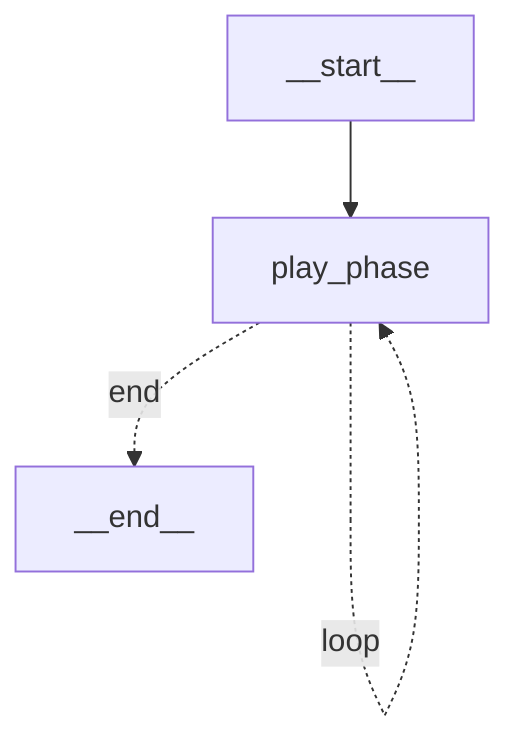

# 项目按 LangGraph 重构报告（外层游戏循环图化）

> 把整局对局的**命令式 while 循环**重构成一张 LangGraph `StateGraph`（带条件循环边）。
> 至此项目形成"**图套图**"：外层游戏编排图驱动每个阶段，阶段内每个 AI 席位再各自跑内层决策子图。
> 验证：`uv run pytest` → **93 passed**（新增 6 个 game_graph 用例）；`--policy random/heuristic/langgraph/llm`
> 四种策略全部经由 LangGraph 游戏图整局收敛。

---

## 1. 重构了什么

**之前**（命令式循环，`app/cli/autoplay.run_game` 内）：
```python
while not state.finished and state.round <= max_rounds:
    for seat in engine.actors_to_act(state):
        engine.apply(state, policies[seat].decide(...))
    engine.advance_phase(state)
```

**之后**（LangGraph 图，`app/agents/game_graph.py`）：一个 `play_phase` 节点 + 一条**条件边**循环：
```python
g = StateGraph(GameLoopState)
g.add_node("play_phase", play_phase)            # 跑完一个阶段：collect→apply→advance
g.add_edge(START, "play_phase")
g.add_conditional_edges("play_phase", route,    # 条件边：结束/超步→END，否则循环回自身
                        {"loop": "play_phase", "end": END})
app = g.compile()
app.invoke({"state": gs, "steps": 0}, config={"recursion_limit": max_steps + 10})
```

`run_game` 现在只构建策略、然后调用 `run_game_graph(...)` 驱动——CLI 行为/输出不变，但底层是 LangGraph。

---

## 2. 游戏图长什么样



- `play_phase`：跑完当前阶段（每个待行动席位用各自策略 `decide` 并 `apply`），再 `advance_phase`，flush 事件。
- **条件边 `route`**：读状态——`finished` 或步数超限 → `END`；否则 → 循环回 `play_phase`。这是本次重构新引入的
  LangGraph 构件（`add_conditional_edges` + 循环），相比内层决策子图的线性图更进一步。

> 注意：循环图必须调高 `recursion_limit`（LangGraph 默认 25）；`run_game_graph` 按 `max_steps+10` 设置。

---

## 3. State 与 reducer

```python
class GameLoopState(TypedDict):
    state: Any                            # 完整 GameState，节点就地推进
    steps: Annotated[int, operator.add]   # 已跑阶段数，累加 reducer，供条件边判断超步
```
- `state` 是共享的 `GameState` 对象引用（节点就地改它，覆盖型通道，从不整体替换）。
- `steps` 用 `operator.add` reducer：每次 `play_phase` 返回 `{"steps": 1}` → 自动累加，条件边据此防死循环。

---

## 4. 图套图：外层编排图 × 内层决策子图

```
外层游戏图(game_graph)          每一步 play_phase 里——
  START → play_phase ─┐          对每个待行动 AI 席位：
        ▲             │             内层决策子图(langgraph_graph)
        └─ loop ──────┘               感知→召回→推理[LLM链]→行动→编码 → 一个 Action
        └─ end → END                → engine.apply 推进牌局
```

- **外层**：游戏阶段的推进与循环（本次重构新增）。
- **内层**：单个 AI 角色"想一步"（之前已用 LangGraph 实现）。
- 两层都跑在 LangGraph 上；引擎仍是纯逻辑、**不 import langgraph**（纯净性测试守护）。

---

## 5. 新增/改动 + 验证

- 新增：`app/agents/game_graph.py`（`GameLoopState` / `build_game_graph` / `run_game_graph`）、`tests/test_game_graph.py`。
- 改动：`app/cli/autoplay.py`（`run_game` 改用 `run_game_graph`）、`app/agents/__init__.py`（导出）。
- 不变：引擎、记忆、规则、联机的接口与行为；`SessionManager.submit_action` 仍是交互式单步路径（事件驱动，不套用批量循环图）。

验证：`uv run pytest` → **93 passed**；四种策略经 LangGraph 游戏图整局收敛；事件 `seq` 连续无洞；
游戏图含 `play_phase` 自循环条件边。

```bash
uv run python -m app.cli.autoplay --game werewolf --players 8 --policy llm
```

## 相关文档
- 内层决策子图：`.review/langgraph决策子图实现报告.md`
- LLM 决策链：`.review/llm-langchain决策实现报告.md`
- 教学文章：`.review/langgraph教学文章.md`
